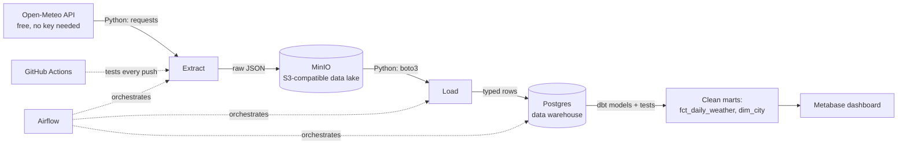

# Architecture

## Diagram

## Layers, in plain language

| Layer | Tool | Role |
|---|---|---|
| Source | Open-Meteo REST API | where the data comes from — free, no signup |
| Extract | Python (`requests`) | pulls raw data, does **no** transformation |
| Data lake | MinIO | stores raw JSON exactly as received, forever |
| Load | Python (`boto3`, `psycopg2`) | moves raw data from lake into warehouse staging tables |
| Warehouse | PostgreSQL | where structured, queryable data lives |
| Transform | dbt | turns raw rows into clean, tested, documented tables |
| Orchestration | Airflow | runs extract → load → transform on a schedule, retries failures |
| CI/CD | GitHub Actions | runs tests automatically on every push |
| BI | Metabase | dashboard on top of the warehouse |

## Why extract, load, and transform are separate steps

This is called **ELT** (Extract, Load, *then* Transform) rather than **ETL**. Raw data is loaded first and transformed afterward inside the warehouse, using dbt — the pattern most modern data teams use, instead of transforming data in-flight before it lands anywhere. See [[04-Design-Decisions]] for the reasoning.

## Data flow, one full run

1. Airflow triggers the DAG (daily, or manually)
2. **Extract task**: calls the API for each city, writes raw JSON to MinIO under `raw/{city}/{date}/{time}.json`
3. **Load task**: reads today's files from MinIO, inserts them into `raw.weather_readings` in Postgres
4. **dbt seed**: loads the city reference list
5. **dbt run**: builds `staging.stg_weather` (cleaned/typed) → `marts.fct_daily_weather` (daily aggregates) and `marts.dim_city`
6. **dbt test**: checks for nulls, duplicates, and other data quality rules
7. You open Metabase and query the `marts` schema
